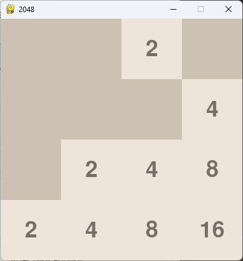

# Мини-игры

## Описание

Небольшой сборник мини игр. С использованием pygame, реализованы такие игры:

* складывание чисел;
* одноруки бандит;
* крестики-нолики;
* тетрис;
* змейка;
* сапер;
* 2048.

Для запуска проекта нужны доп библиотеки:

* pygame~=2.5.2
* PyAutoGUI~=0.9.54

## Авторы

### Артемов Никита Петрович - БСБО-09-22

### Шутов Кирилл Сергеевич - БСБО-08-22

## Скриншоты

