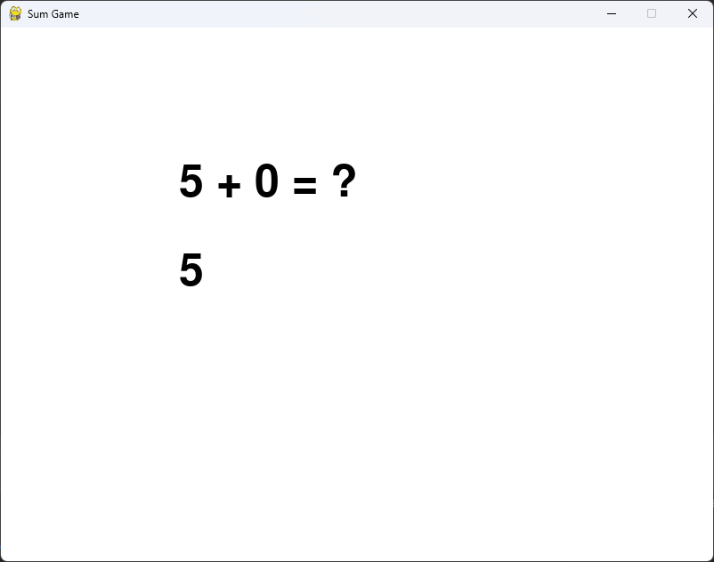

# Сборник мини-игр

Rus | [Eng](../../README.md)

## Описание

Небольшой сборник мини игр. С использованием pygame, реализованы такие игры:

* крестики-нолики;
* игровой автомат;
* змейка;
* сапер;
* тетрис;
* числа;
* 2048.

### Лицензия

``` text
MIT Лицензия
```

## Скриншоты





